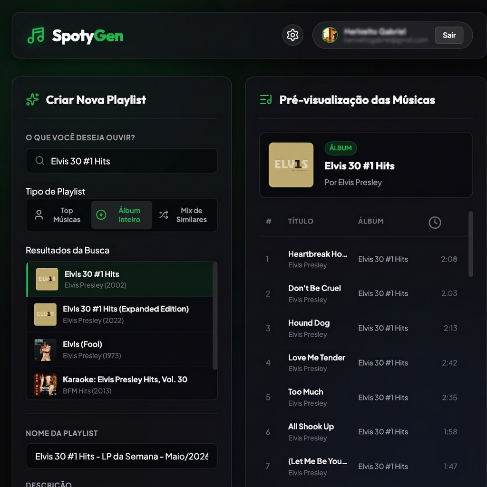

# 🎵 SpotyGen - Spotify Playlist Generator

SpotyGen é um aplicativo web (SPA - Single Page Application) moderno, responsivo e esteticamente premium projetado para criar e gerar playlists personalizadas diretamente na sua conta do Spotify. 

A aplicação utiliza puramente tecnologias client-side (HTML5, CSS3, Vanilla JS) e faz integração direta com a **Spotify Web API** através do fluxo seguro de autorização **OAuth 2.0 com PKCE (Proof Key for Code Exchange)**, eliminando a necessidade de expor credenciais secretas no cliente.



---

## 🚀 Como Rodar e Acessar

### Modo Local (Desenvolvimento)
- **URL Padrão**: `http://localhost:3000`
- Nenhuma autenticação básica é requerida no modo local.

### Modo Produção (Hospedado no Servidor)
- **URL de Acesso**: `https://seu-dominio.com/` (ou o IP público configurado)
- **Usuário de Acesso (Basic Auth)**: `admin`
- **Senha Padrão**: `spotygen123`

---

## 🛠️ Tecnologias Utilizadas

### Frontend & Estilização
- **HTML5 Semântico**: Estrutura robusta, acessível e otimizada para SEO.
- **CSS3 Moderno**: 
  - Design System baseado em variáveis customizadas.
  - Efeitos de **Glassmorphism** de última geração (transparências embaçadas, bordas sutis e sombras profundas).
  - Micro-animações suaves e transições em estados de `:hover` e `:active`.
  - Layout totalmente responsivo utilizando CSS Grid e Flexbox.
- **Vanilla JavaScript (ES6+)**: Lógica limpa e reativa, sem frameworks pesados, garantindo carregamento instantâneo.
- **Lucide Icons**: Iconografia moderna em formato SVG dinâmico.
- **Google Fonts (Inter)**: Tipografia limpa, moderna e altamente legível.

### Segurança & APIs
- **Spotify Web API**: Integração completa para busca de artistas/álbuns e criação de playlists.
- **OAuth 2.0 + PKCE**: Fluxo de autorização padrão da indústria para aplicações sem servidor backend (Single Page Apps).
- **SSL/TLS (Let's Encrypt)**: Conexão criptografada de ponta a ponta (HTTPS) rodando sob protocolo HTTP/2.
- **Nginx Basic Authentication**: Camada de proteção por senha integrada ao servidor web para evitar exposição pública inadequada.

### Infraestrutura
- **Oracle Linux VM**: Sistema operacional da hospedagem.
- **Nginx**: Servidor web e proxy reverso leve de alta performance.
- **SELinux**: Regras de controle e segurança de arquivos.
- **Firewalld**: Bloqueio de portas desnecessárias e liberação seletiva de HTTP/HTTPS.

---

## ⚙️ Configuração no Spotify Developer Dashboard

Como a aplicação roda de forma segura no seu domínio ou localmente, você deve configurar as URLs de redirecionamento no painel do Spotify Developer:

1. Acesse o [Spotify Developer Dashboard](https://developer.spotify.com/dashboard).
2. Selecione ou crie o seu aplicativo.
3. Clique no botão **Edit** ou acesse as configurações.
4. Adicione o seguinte endereço na lista de **Redirect URIs** dependendo do seu ambiente:
   - Para ambiente local: `http://localhost:3000/`
   - Para ambiente de produção: `https://seu-dominio.com/`
   *Nota: Certifique-se de incluir a barra final `/`.*
5. Salve as alterações.
6. Copie o seu **Client ID** gerado pelo Spotify.
7. Acesse a aplicação, clique no ícone de engrenagem ⚙️ no canto superior direito, cole o seu Client ID e salve.


---

## 💾 Instalação no Linux (Servidor Próprio)

Disponibilizamos o script automatizado `install.sh` que faz a instalação completa das dependências, baixa os arquivos, gera o certificado SSL gratuito Let's Encrypt e configura as regras do Nginx.

### Pré-requisitos
- Um servidor rodando **Oracle Linux 7/8**, **CentOS 7/8** ou **RHEL 7/8**.
- Acesso à internet e uma porta 80 e 443 aberta e apontada para o IP público do servidor (ex: através do serviço `nip.io`).

### Passo a Passo de Execução:

1. **Clonar o Repositório**:
   ```bash
   git clone https://github.com/heriveltogabriel/SpotyGen.git
   cd SpotyGen
   ```

2. **Dar permissão de execução ao script**:
   ```bash
   chmod +x install.sh
   ```

3. **Executar o script como root ou sudo**:
   ```bash
   sudo ./install.sh
   ```

### O que o script realiza de forma automatizada:
1. Instala o Nginx, Certbot e as ferramentas do Apache/Nginx (`httpd-tools`).
2. Copia os arquivos da aplicação (`index.html`, `style.css`, `app.js`, `config.js`) para a pasta de hospedagem `/usr/share/nginx/html`.
3. Ajusta o proprietário e permissões de leitura dos arquivos para o usuário do Nginx.
4. Gera um arquivo de autenticação básica `/etc/nginx/.htpasswd` com credenciais padrão (`admin`/`spotygen123`).
5. Solicita e gera o certificado SSL Let's Encrypt para o domínio configurado.
6. Cria o arquivo de configuração `/etc/nginx/conf.d/spotygen.conf` incluindo regras HTTPS, HTTP/2 e as regras do Basic Auth.
7. Atualiza o contexto do **SELinux** para permitir que o Nginx leia as novas configurações e arquivos de site sem dar erro `403 Forbidden`.
8. Habilita o Nginx na inicialização do sistema e reinicia o serviço.

---

## 🔒 Gerenciando a Segurança da Aplicação

### Alterando Usuário e Senha (ou apenas Senha)
Após a instalação, é altamente recomendado que você altere as credenciais padrão. Acesse o seu servidor por SSH:

* **Para alterar apenas a senha do usuário `admin` atual**:
  ```bash
  sudo htpasswd /etc/nginx/.htpasswd admin
  ```
  Digite a sua nova senha e confirme.

* **Para alterar o nome do usuário e a senha** (substituindo o antigo):
  ```bash
  sudo htpasswd -c /etc/nginx/.htpasswd novo_usuario
  ```
  *(Substitua `novo_usuario` pelo nome desejado. O parâmetro `-c` recria o arquivo limpando o antigo).*


### Como funciona o OAuth PKCE
O SpotyGen não armazena o seu token de acesso no servidor. Ao clicar em **Conectar Spotify**, um código aleatório (`code_verifier`) e seu hash SHA256 (`code_challenge`) são gerados no seu próprio navegador. 

Após a autorização bem-sucedida na página oficial do Spotify, o Spotify redireciona de volta para o SpotyGen com um código temporário de autorização. O SpotyGen então troca esse código pelo Token de Acesso diretamente com os servidores do Spotify. Todo o processo acontece em memória no navegador, tornando-o extremamente seguro contra vazamentos no lado do servidor.
